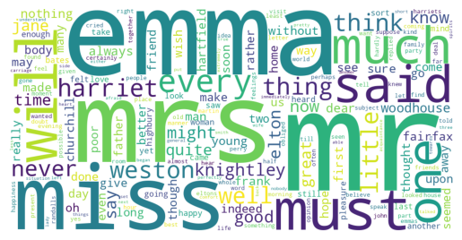

# 💬 Chat Word Cloud Generator
[](https://colab.research.google.com/github/mohansree/wordcloud/blob/main/WordCloud.ipynb)

Visualize the words you use most. This project analyzes a body of text and generates a word cloud weighted by frequency — originally built to process a personal **ChatGPT conversation export**, with a fallback to Jane Austen's Emma from the NLTK Gutenberg corpus.

# 🖼 Example Output
<div align="center">
  
</div>

Run the notebook to get your own.

# 💡 Motivation

I wanted to see which words and topics I reach for most often in my ChatGPT conversations. Since the export data wasn't available at the time, I used a classic novel as a stand-in — the pipeline is identical, just swap in your own text file.

# 🚀 Get Started
Click the **Open in Colab** badge above — no setup needed, just run all cells.

# 🔧 Using your own text

To use your ChatGPT export (or any text file) instead of the demo dataset, replace the data-loading cell in the notebook:
```
# Replace this:
text = gutenberg.raw('austen-emma.txt')

# With this:
with open('your_export.txt', 'r', encoding='utf-8') as f:
    text = f.read()
```

# Exporting your ChatGPT data

1. Go to ChatGPT → Settings → Data Controls → Export Data
2. You'll receive a .zip file — extract conversations.json
3. Parse the JSON to extract message text, then save as a .txt file

# 🛠 How it works
1. Load — reads raw text from the Gutenberg corpus (or your own file)
2. Normalize — lowercases and strips punctuation/numbers
3. Filter — removes common stopwords (e.g. "the", "and", "is")
4. Count — tallies word frequencies using Counter
5. Visualize — renders a word cloud scaled by frequency

# 📌 Future Ideas

- Parse `conversations.json` from ChatGPT export directly
- Add a custom stopword list to filter filler words specific to chat
